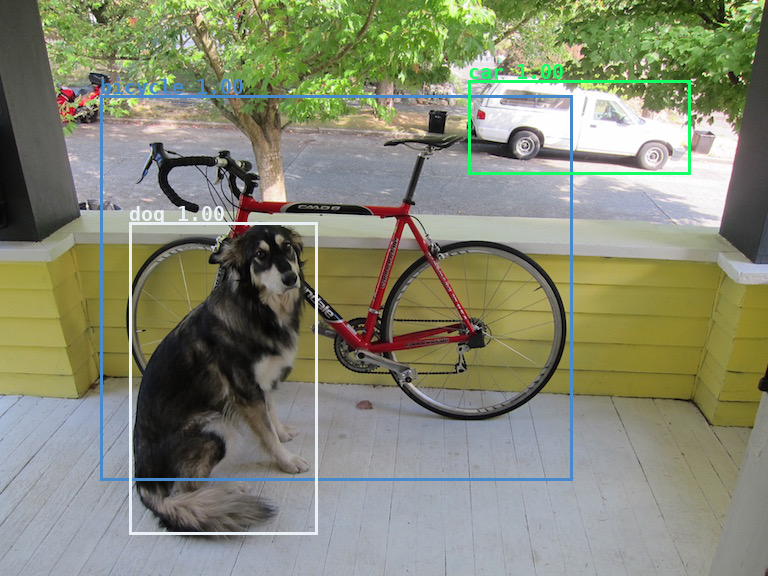

# YOLOv3 Object Detection with the ONNX TensorRT Backend In Python

**Information**
- [YOLOv3-TensorRT](https://github.com/linghu8812/YOLOv3-TensorRT) has benn deprecated. Please see [tensorrt_inference/project/Yolov4](https://github.com/linghu8812/tensorrt_inference/tree/master/project/Yolov4), which has updated new YOLO models includes YOLOv3-SPP, YOLOv3-tiny, YOLOv4, YOLOv4-tiny, YOLOv4x-mish an so on. 


**Table Of Contents**
- [Introduction](#introduction)
- [Prerequisites](#prerequisites)
- [How does this sample work?](#how-does-this-sample-work)
- [Running the sample](#running-the-sample)
- [Reference](#reference)


## Introduction

This sample, implements a full ONNX-based pipeline for performing inference with the YOLOv3 network, which the input size can be assigned by set `--width` and `--height` in [onnx_to_tensorrt.py](onnx_to_tensorrt.py), and int8 mode can also be set by add `--int8` in [onnx_to_tensorrt.py](onnx_to_tensorrt.py), including pre and post-processing. This sample is based on the [YOLOv3-608](https://pjreddie.com/media/files/papers/YOLOv3.pdf) paper.

## Prerequisites

For specific software versions, see the [TensorRT Installation Guide](https://docs.nvidia.com/deeplearning/sdk/tensorrt-archived/index.html).

1.  Install [ONNX-TensorRT: TensorRT backend for ONNX](https://github.com/onnx/onnx-tensorrt). ONNX-TensorRT includes layer implementations for the required ONNX operators `Upsample` and `LeakyReLU`.

2.  Install the dependencies for Python.
	-   For Python 2 users, from the root directory, run:
	`python2 -m pip install -r requirements.txt`

	-   For Python 3 users, from the root directory, run:
	`python3 -m pip install -r requirements.txt`

## How does this sample work?

First, the original YOLOv3 specification from the paper is converted to the Open Neural Network Exchange (ONNX) format in `yolov3_to_onnx.py` (only has to be done once).

Second, this ONNX representation of YOLOv3 is used to build a TensorRT engine, followed by inference on a sample image in `onnx_to_tensorrt.py`. The predicted bounding boxes are finally drawn to the original input image and saved to disk.

After inference, post-processing including bounding-box clustering is applied. The resulting bounding boxes are eventually drawn to a new image file and stored on disk for inspection.

## Running the sample

- Create an ONNX version of YOLOv3 with the following command.<br>
	````
	python3 yolov3_to_onnx.py --cfg_file yolov3.cfg --weights_file yolov3.weights --output_file yolov3.onnx
	````


- Build a TensorRT engine from the generated ONNX file and run inference on a sample image.
	````
	python3 onnx_to_tensorrt.py --onnx_file yolov3.onnx --engine_file yolov3.trt
	````
	If you want to run in int8 mode, you can run the code like this
	````
	python3 onnx_to_tensorrt.py --int8 --onnx_file yolov3.onnx --engine_file yolov3_int8.trt
	````

- Saved image with bounding boxes of detected objects to dog_bboxes.png. You can verify that the sample ran successfully.<br>


## Reference

The following resources provide a deeper understanding about the model used in this sample, as well as the dataset it was trained on:

**Dataset**
- [COCO dataset](http://cocodataset.org/#home)
- [PASCAL VOC dataset](http://host.robots.ox.ac.uk/pascal/VOC/)

**Documents**
- [YOLOv3: An Incremental Improvement](https://pjreddie.com/media/files/papers/YOLOv3.pdf)
- [Introduction To NVIDIA’s TensorRT Samples](https://docs.nvidia.com/deeplearning/sdk/tensorrt-sample-support-guide/index.html#samples)
- [Working With TensorRT Using The Python API](https://docs.nvidia.com/deeplearning/sdk/tensorrt-developer-guide/index.html#python_topics)
- [NVIDIA’s TensorRT Documentation Library](https://docs.nvidia.com/deeplearning/sdk/tensorrt-archived/index.html)
